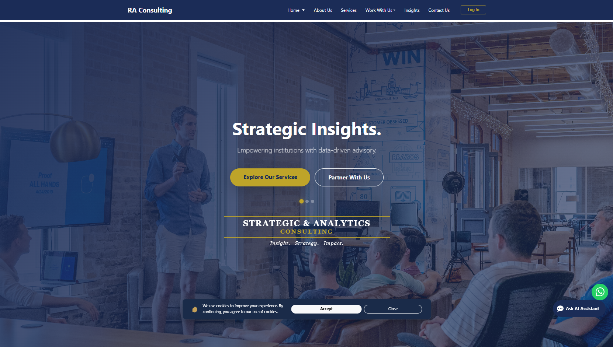
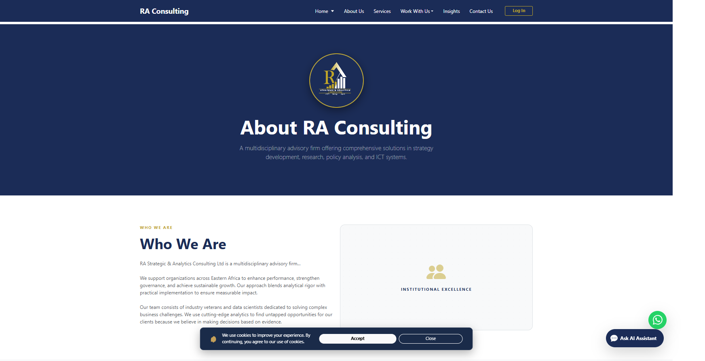
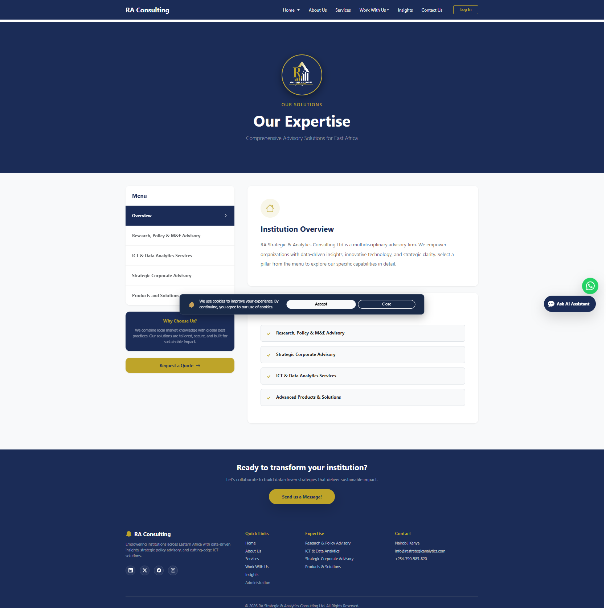
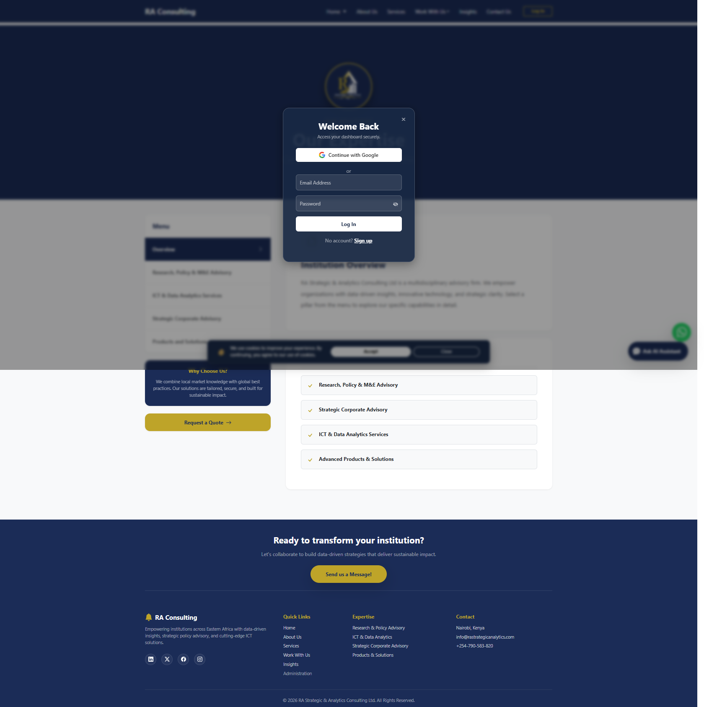

# RA Strategic & Analytics Consulting Website

[](https://ra-consulting-site.vercel.app/)

A modern, responsive Vue.js web application for RA Strategic & Analytics Consulting, providing strategic research, data analytics, and governance advisory solutions across East Africa.

## 🌟 Live Preview

Experience our website in action: [RA Consulting Live Site](https://ra-consulting-site.vercel.app/)

### Screenshots

#### Home Page


*Hero section with company overview, key services, client testimonials, and social media feed.*

#### About Us


*Mission, vision, values, organizational structure, and team information.*

#### Services


*Detailed service offerings including Research & Policy Advisory, ICT & Data Analytics, Strategic Corporate Advisory, and Products & Solutions.*

#### Admin Login


*Secure login portal for accessing the admin CMS dashboard with Google authentication and manual login options.*

Navigate through the pages to see smooth transitions, responsive design, and interactive features like our AI chatbot and WhatsApp integration.

## 🚀 Features

- **Responsive Design**: Optimized for desktop, tablet, and mobile devices
- **Modern UI/UX**: Clean, professional interface using Bootstrap 5
- **Dynamic Routing**: Vue Router for seamless page navigation
- **Admin Panel**: Secure dashboard for content management
- **AI Chatbot**: Integrated conversational assistant
- **WhatsApp Integration**: Direct messaging capability
- **Firebase Backend**: Real-time database and authentication
- **SEO Optimized**: Meta tags and structured data
- **Performance Focused**: Vite build system for fast loading
- **Accessibility**: WCAG compliant design patterns

## 🛠️ Tech Stack

### Frontend
- **Vue.js 3** - Progressive JavaScript framework
- **Vue Router 4** - Official router for Vue.js
- **Bootstrap 5** - CSS framework for responsive design
- **Vite** - Fast build tool and development server

### Backend & Services
- **Firebase** - Backend-as-a-Service (Authentication, Database, Hosting)
- **Google One Tap** - Simplified authentication
- **WhatsApp API** - Business messaging integration

### Development Tools
- **Vite** - Build tool and dev server
- **ESLint** - Code linting
- **Git** - Version control

## 📋 Prerequisites

- Node.js (v16 or higher)
- npm or yarn package manager
- Git

## 🔧 Installation

1. **Clone the repository**
   ```bash
   git clone https://github.com/your-username/ra-consulting-site.git
   cd ra-consulting-site
   ```

2. **Install dependencies**
   ```bash
   npm install
   ```

3. **Set up Firebase configuration**
   - Create a Firebase project at [Firebase Console](https://console.firebase.google.com/)
   - Enable Authentication and Firestore Database
   - Copy your Firebase config to `src/firebase.js`

4. **Start development server**
   ```bash
   npm run dev
   ```

5. **Build for production**
   ```bash
   npm run build
   ```

6. **Preview production build**
   ```bash
   npm run preview
   ```

## 📁 Project Structure

```
ra-consulting-site/
├── public/                 # Static assets
│   ├── files/             # Uploaded files
│   ├── logo/              # Logo assets
│   └── Placeholder-Images/ # Image placeholders
├── src/
│   ├── assets/            # Vue assets
│   ├── components/        # Vue components
│   │   ├── admin/         # Admin panel components
│   │   └── ...            # Page components
│   ├── directives/        # Custom Vue directives
│   ├── views/             # Page views
│   ├── App.vue            # Root component
│   ├── main.js            # Application entry point
│   ├── router.js          # Vue Router configuration
│   ├── store.js           # Vuex store (if used)
│   └── firebase.js        # Firebase configuration
├── index.html             # HTML template
├── vite.config.js         # Vite configuration
└── package.json           # Dependencies and scripts
```

## 🚀 Deployment

### Vercel (Recommended)
1. Connect your GitHub repository to Vercel
2. Configure build settings:
   - Build Command: `npm run build`
   - Output Directory: `dist`
3. Add environment variables for Firebase
4. Deploy automatically on push

### Other Platforms
The built files in `dist/` can be deployed to any static hosting service:
- Netlify
- GitHub Pages
- AWS S3 + CloudFront
- Firebase Hosting

## 🔐 Environment Variables

Create a `.env` file in the root directory:

```env
VITE_FIREBASE_API_KEY=your_api_key
VITE_FIREBASE_AUTH_DOMAIN=your_auth_domain
VITE_FIREBASE_PROJECT_ID=your_project_id
VITE_FIREBASE_STORAGE_BUCKET=your_storage_bucket
VITE_FIREBASE_MESSAGING_SENDER_ID=your_sender_id
VITE_FIREBASE_APP_ID=your_app_id
```

## 🤝 Contributing

1. Fork the repository
2. Create a feature branch (`git checkout -b feature/amazing-feature`)
3. Commit your changes (`git commit -m 'Add amazing feature'`)
4. Push to the branch (`git push origin feature/amazing-feature`)
5. Open a Pull Request

### Development Guidelines
- Follow Vue.js style guide
- Use ESLint for code quality
- Write meaningful commit messages
- Test on multiple devices/browsers
- Ensure accessibility compliance

## 📄 License

This project is proprietary software. All rights reserved.

## 📞 Contact

RA Strategic & Analytics Consulting
- Website: [https://rastrategicanalytics.com/](https://rastrategicanalytics.com/)
- Email: info@rastrategicanalytics.com
- Phone: +254 XXX XXX XXX

## 🙏 Acknowledgments

- Bootstrap team for the excellent CSS framework
- Vue.js community for the amazing framework
- Firebase for reliable backend services
- Vercel for seamless deployment

---

Built with ❤️ using Vue.js and Vite   (Feiswal Dindi)